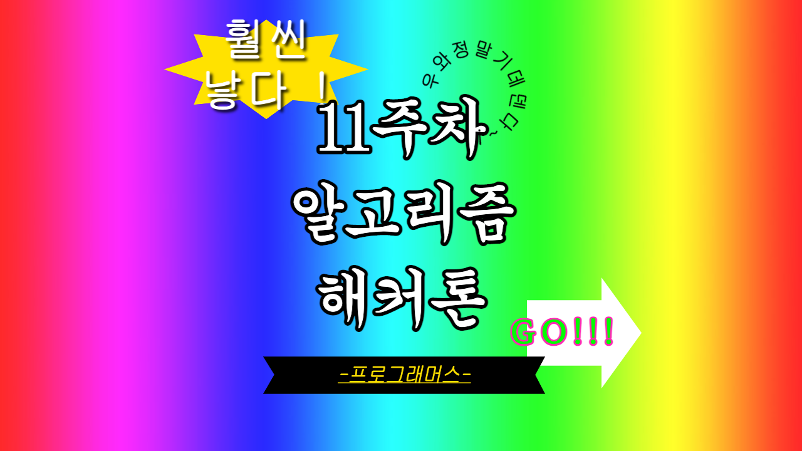

## 🌱 11주차 해커톤

#### 🖋 2023 KAKAO BLIND RECRUITMENT 개인정보 수집 유효기간

[2023 KAKAO BLIND RECRUITMENT 개인정보 수집 유효기간](https://school.programmers.co.kr/learn/courses/30/lessons/150370?language=python3)

```python
def plusMonth(today, month, date, index):
    y, m, d = map(int, date.split("."))
    ty, tm, td = map(int, today.split("."))

    y += int(month) // 12
    m += int(month) % 12
    if m > 12:
        m -= 12
        y += 1

    if y < ty:
        return True
    elif y > ty:
        return False
    else:
        if m < tm:
            return True
        elif m > tm:
            return False
        else:
            if d < td:
                return True
            elif d > td:
                return False

    return True

def solution(today, terms, privacies):
    d = dict()
    answer = []

    for t in terms:
        a, b = t.split()
        d[a] = b

    for i in range(len(privacies)):
        date, t = privacies[i].split()

        if plusMonth(today, d[t], date, i):
            answer.append(i + 1)

    return answer
```

더할 수 있는 개월 수가 1년을 넘어간다는 사실을 망각하고 처음에는 개월 수를 더하고 12를 넘어가면 12를 빼주고 1년을 더해주는 식으로 해결하려 했다. 테스트케이스는 맞았지만 채점해보니 틀려서, 문제를 다시 읽어봤다. 1년 이상 넘어갈 수 있구나를 깨닫고 다시 짠 코드이다.

사실 좀 길긴 하지만 어떤 방식으로 풀었는지 직관적이긴 하다. 하지만 코드가 가독성이 떨어지는 점이 맘에 안들었는데, 친구가 좋은 아이디어를 줬다. 다 '일수'로 바꿔서 계산하면 된다. 사실 내가 datetime 모듈을 쓰려다 말았는데, 거기서도 결국 날짜를 받으면 숫자로 치환해서 비교를 한 결과를 알려주는 것이기 때문에 일맥상 통한다고 볼 수 있다.

```python
def solution(today, terms, privacies):
    answer = []
    today = list(map(int, today.split('.')))
    today = today[2] + today[1] * 28 + today[0] * 28 * 12

    dic = {}
    for data in terms:
        code, month = data.split(" ")
        dic[code] = int(month) * 28

    for i in range(len(privacies)):
        day, code = privacies[i].split()
        day = list(map(int, day.split('.')))
        day = day[2] + day[1] * 28 + day[0] * 28 * 12
        if day + dic[code] <= today:
            answer.append(i + 1)

    return answer
```

### 🖋 2023 KAKAO BLIND RECRUITMENT 이모티콘 할인행사

[2023 KAKAO BLIND RECRUITMENT 이모티콘 할인행사](https://school.programmers.co.kr/learn/courses/30/lessons/150368?language=python3)

```python
import math
from itertools import product

def solution(users, emoticons):
    answer = []
    tempAnswer = []
    emoticonsPercent = list(product([10, 20, 30, 40], repeat=len(emoticons)))

    for p in emoticonsPercent:
        userCount = 0
        userSale = 0

        for userPercent, userPrice in users:
            sale = 0

            for i in range(len(p)):
                if p[i] >= userPercent: # 구매
                    sale += emoticons[i] * (100 - p[i]) * 0.01
            if sale >= userPrice:
                sale = 0
                userCount += 1
            else:
                userSale += sale

        answer.append([userCount, math.ceil(userSale)])

    answer.sort(reverse=True)
    answer = answer[0]
    return answer
```

다 확인하는 거 이외에는 딱히 생각나는 해결법이 없었다. 그래서 중복순열을 이용해서 각 이모티콘별로 할인율을 배당해주었다. 유저마다 각 이모티콘의 할인율이 유저의 할인율보다 클 때는 sale에 할인된 이모티콘 가격을 더해준다. 모든 이모티콘을 순회하며 이 작업을 해준 뒤, 유저가 원하는 가격보다 구매가격이 클 경우, sale을 0으로 바꿔주고 userCount를 1 더해준다. 여기에는 각 이모티콘 할인율의 조합별로, 이모티콘을 구매하는 유저의 수를 저장해주었다. 또, 구매가격이 크지 않다면 userSale에 sale를 더해주었다. userSale에는 각 이모티콘 할인율의 조합별로, 전체 유저가 구매하는 이모티콘 판매가격을 저장한다. 이렇게 유저별로 모두 순회하고 난 다음, userCount, userSale을 answer에 담아준다. answer를 마지막에 내림차순으로 정렬하면, 자동으로 첫번째, 두번째 요소 기준으로 정렬을 해주기 때문에 가장 앞의 요소만 뽑아내면 정답이다.

처음에 문제를 보고 겁부터 먹고 정말 풀기 싫었다. 한 시간의 시간 제한을 두고 풀었는데 15분 정도는 하기 싫다... 하기 싫다... 하며 보낸 것 같다. 막상 코드를 짜 보니 어렵지 않았다. 한 가지 문제가 있다면 순열 라이브러리를 기억하지 못해서 또 다시 검색을 해야했다는 점. 라이브러리 검색이 불가능했다면 풀지 못했을 문제라는 점이 한계점이다. 이 부분에 대해 다시 깊이있게 공부해야겠다!

백트래킹이라는 사실을 알았다. 우울하다. 다음 주는 백트래킹 두개 공부하기!!!