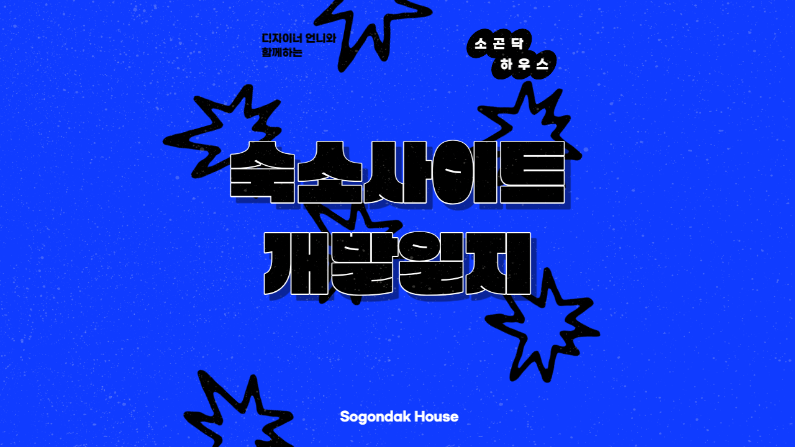

글로 개발 과정을 쓴다는 게 아직 나에겐 너무너무 어색하고 어렵다. 독서를 정말 싫어하는 나는 일기 쓰는 것도 힘들어하는 사람이기 때문이다. 그럼에도 불구하고 개발 과정을 쓰려는 이유는 포트폴리오를 만들기 위함에도 있지만, 당장 작년에 만든 것만 해도 어떤 기능을 적용했었는지, 어떤 이유에서 적용했었는지, 어떤 라이브러리를 사용했었는지 등등 새롭게 배운 것들이 기억이 나지 않는다. 예를 들어서 카카오톡 지도 API를 KIYO에 적용하기 위해 열심히 문서를 읽었었지만 다시 쓰려고 하니 쉽지 않았다.

그래서 쓰게 된 개발일지이지만, 사실 정석대로라면 있어야할 와이어프레임, 프로토타입 등등은 아무것도 존재하지 않는 초초초소규모 프로젝트이다. 그냥 언니를 위한 선물(?)을 기록해놓고 싶은 마음에 쓰는 개발일기랄까...

## 🏝

언니네 부부가 제주도에서 숙박업을 하고 있다. 이번에 카페와 함께 리뉴얼을 해서, 기존에 블로그에만 있던 숙소 정보를 사이트에서 관리를 하려고 하는데, 디자이너인 언니가 웹디자인이라고 하긴 민망하고,,, 와이어프레임 정도를 짜서 주기로 했다. 처음에는 내가 그냥 개괄적으로 만들어보기로 해서 여러가지 숙소나 쇼핑 사이트들을 찾아 레퍼런스 삼으려 했는데 어쨌든 클라이언트가 원하는 방향을 만나서 하지 않는 이상 전달받기 힘들었다. 그래서 언니가 구상한 이미지를 주면 내가 바로 퍼블리싱하는 방식으로 작업을 진행하고 있다. (작업이라고 하니까 있어보이지만 정말 퍼블리싱 그 뿐...)

## 📐 기획 & 디자인 그리고 개발

기획과 디자인이라고 하기에 민망한 수준이긴 하지만, 이번 프로젝트는 '애자일' 그 자체였다고 할 수 있다.

애자일의 끝판왕을 보여주는 디자이너와의 카톡... 수정사항 100만가지지만 덕분에 포트폴리오도 채우고, 요즘 손놓고 있었던 프론트 개발도 할 수 있어서 즐겁게 하는 중이다.

크게 필요한 페이지는 네 페이지이다. Home페이지, About페이지, Room페이지, Reservation페이지.

Home페이지는 숙소를 홍보할 예쁜 사진들과 문구로 채웠다. 사실 이 부분에 대한 고민이 많았는데 css를 오랜만에 만지다보니 이미지 다루는 게 조금 헷갈렸다. 손 놓으면 정말 빠르게 퇴화된다는 걸 느꼈다.

About페이지는 숙소 체크인 / 체크아웃 시간, 위치, 교통편, 주차, 카페 안내로 채웠다. 지도는 그저 사진으로 넣어도 무방하지만, 이왕 하는 김에 네이버 지도를 연결했다. 방금 떠오른 생각인데, 지도 스크롤이나 줌을 비활성화하고 지도를 누르면 네이버지도로 연결되게끔 하는 것도 좋을 것 같다...! 반영해야지😎

Room페이지는 각 방별로 설명, 인원설명, 비품 등에 대한 내용을 채웠다. 여기에도 고민이 있었다. 룸 페이지에 들어간 다음에 각 방을 다시 선택하게끔 할지, 메뉴에서 아예 방을 선택해서 라우팅할지에 대한 고민이었다. 이에 대한 고민은 언니가 해결해주었다.

위 사진은 언니가 고민한 흔적! Dropdown 메뉴 디자인을 이렇게 저렇게 바꿔본 흔적이다. 결국 마지막 디자인 당첨! 깔끔하고 귀여워서 마음에 든다. 여기서 antd의 Dropdown의 메뉴를 커스텀해서 만들었는데, DOM 조작을 해서 모달 만들듯이 하려니까 매우 복잡했다. 그래서 수정도 편리한 antd 컴포넌트를 이용했다.

Reservation페이지는 예약에 관한 중요 안내 사항을 적어두었다. Collapse 메뉴를 사용해서 보기 편리하게 구현했다.

언니의 예시 이미지.
밑으로 내려오는 목록 만들고 싶다던 언니. 하나하나 진아야, 이거 만들 수 있어? 진아야, 이거 구현 가능해? 물어봐줬는데 다 된다고 하니까 언니가 되게 좋아했다. 사실 매우 쉬운거야 언니...

## 🕶 배포

가비아에서 도메인을 구매했다. 프로젝트를 여러 번 하면서, 도메인을 구매하는 것까지는 해본적이 없는데, 이번 기회에 경험할 수 있었다. 가비아에서 약 2-3만원에 언니가 구매를 한 뒤, 네임서버 설정 등을 해줬다. netlify 자체에서 제공해주는 기능들을 통해 쉽게 할 수 있었는데, HTTPS 설정이 안되고 있어서 조금 애를 먹는 중... 이 부분은 다시 업데이트를 해야겠다.

아직 맘에 들지 않는 부분들도 있고, 고쳐나갈 부분들도 있지만, 일단은 이렇게 해서 배포 완료!

