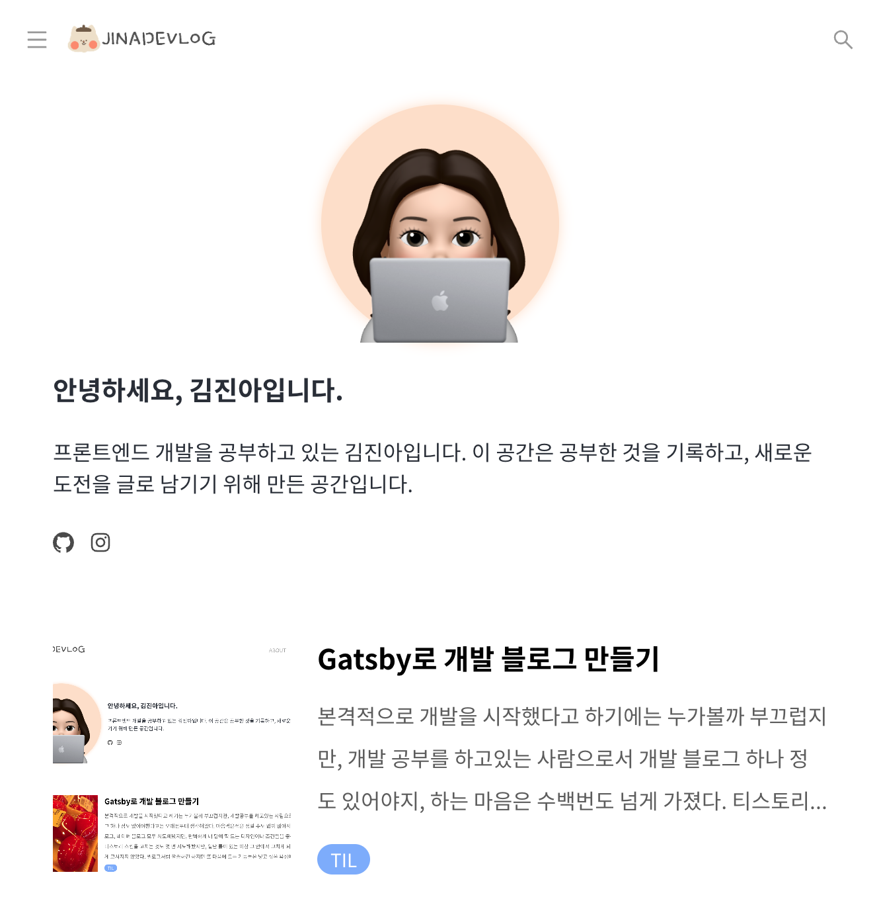

본격적으로 개발을 시작했다고 하기에는 누가볼까 부끄럽지만, 개발 공부를 하고있는 사람으로서 개발 블로그 하나 정도 있어야지, 하는 마음은 수백번도 넘게 가졌다. 티스토리, 벨로그, 네이버 블로그 정말 다양하게 모두 시도해봤지만, 완벽하게 내 마음에 딱 드는 디자인이나 조건을 찾지 못했다.

티스토리 스킨을 고쳐볼까하는 생각에 몇 번 시도도 해보았지만, 일단 정해진 틀이 있는 이상 나의 창의력과 상상력을 가로막기 때문에 그 안에서 고치게 되는 경향이 있었다. 그렇기에 마음에 들게 고쳐질 수가 없는 법. 벨로그처럼 깔끔하면서 어떤 부분은 귀엽기도 하고, 특정 기능은 들어갔으면 좋겠는, 그런 욕심에 벼르고 벼르던 개발 블로그를 드디어 만들게 되었다.

취준을 하면서 시간 관리도 제대로 되지 않고, 혼자 공부했기 때문에 부족한 점이 많아 이 점을 채우기 위해 부트캠프를 수강하고 있는데, 아직 초반이라 과제를 일찍 끝내놓고 시간이 많이 남는다. 이 시간을 이용해 동기부여도 할 겸, 개발 블로그를 만들기 시작했다.

엄청 유능하신 분들께서 깃허브 페이지로 만드는 블로그 스킨을 만들어두셔서 이를 수정하는 방향도 생각해봤다. 그런데 또 어떤 것은 썸네일이 없어서 마음에 안들고, 어떤 것은 이게 마음에 안들고 등등... 까다로운 내 입맛을 도대체 만족시켜주는 것을 찾을 수가 없었다. 내가 만든 스킨이 아니다보니 수정하는 것은 더더욱 어려웠다.

스킨이 없이 시작하려니 내가 직접 추가해야할 부분들도 너무 많고 생각해야하는 것도 너무 많은 대규모 프로젝트였지만, 회사 다닐 때 새로운 프로젝트를 시작하던 그 때 생각도 나고 완전히 '내 것'을 만든다는 생각에 이틀만에 뚝딱 만들게 되었다. 아직 수정해야할 부분들이 정말 많지만, 일단은 개발 블로그 틀을 잡는 건 성공했다. 이걸 이제 깃허브에 배포를 하고 깃헙 페이지 자동화까지 하려고 하는데, 세상에 공개하기 전에 일주일 정도 손을 봐야할 부분들이 눈에 정말 많이 들어온다. 리스트화 해놓고, 테스크를 지워나가면서 좀 더 견고한 블로그를 만들어야지.

